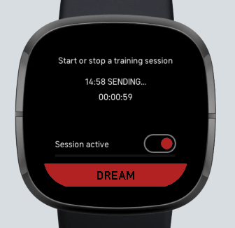

# Fitbit Lucid Trainer

A Fitbit SDK 5.0 App to capture sleep related data and send to an external REST service. UI built upon examples in [sdk-app-demo](https://github.com/Fitbit/sdk-app-demo). 

The goal of this project is to provide access to real-time data to develop a customized algorithm for identifying REM sleep state. Future updates will add a lucid dreaming induction option via vibration. The app can be built and sideloaded onto the Sense and Versa 3. It may work with the Sense 2 and Versa 4 as well but it's unclear currently if those watches will support custom apps. 

The app provides a simple menu with the option to start a session or view a log of recent activity. Views are exited by swiping the screen from left to right.


The session view provides a toggle button to start/stop an active capture session. During the session, a batch sampling of accelerometer, heart rate and the sleep sensor data is taken and averaged on a time increment (defaulting to every one minute) and then posted to a REST service (defaulting to the test service https://httpbin.org). The view provides feedback about the state of the connection with the service and the session duration. The user can also use the Dream button to signal waking from a recent dream.



An example of the REST payload posted to the server, which will be returned in the response if using httpbin.

```
{
  "_id": {
    "$oid": "6520fe66c6b358e5d5126a57"
  },
  "hr": "54",
  "hrVar": "0.4039",
  "hrArray": "53,53,54,54,53,53,53,53,53,53,53,53,53,53,53,54,54,54,54,54,54,54,54,55,55,55,54,54,54,54",
  "accelx": "-5.5739,-5.5595,-5.5918,-5.5751,-5.5427,-5.5655,-5.5918,-5.5763,-5.6158,-5.6337,-5.5870,-5.5511,-5.6098,-5.6098,-5.5380,-5.5751,-5.6265,-5.6146,-5.5739,-5.5870,-5.6146,-5.5799,-5.5667,-5.5870,-5.5607,-5.5799,-5.6218,-5.6026,-5.5631,-5.5894",
  "accely": "2.3488,2.3584,2.3667,2.3189,2.3296,2.3572,2.3416,2.3308,2.3368,2.4098,2.3631,2.3177,2.3488,2.3967,2.2937,2.3464,2.3967,2.3320,2.3212,2.3368,2.3667,2.3476,2.3356,2.3236,2.3859,2.3811,2.3679,2.3739,2.3560,2.3452",
  "accelz": "7.7263,7.7036,7.7024,7.7359,7.6940,7.6485,7.6940,7.7203,7.6832,7.6533,7.7275,7.6988,7.6832,7.7024,7.6844,7.7239,7.5934,7.6736,7.7191,7.6808,7.6617,7.6952,7.7096,7.6772,7.6557,7.6916,7.6832,7.6796,7.7275,7.7144",
  "accelmove": "0.0170",
  "gyrox": "-0.0032,0.0011,-0.0032,0.0000,0.0043,0.0000,0.0000,0.0043,0.0000,-0.0064,0.0000,0.0075,0.0043,-0.0043,0.0000,0.0075,-0.0107,0.0000,-0.0011,0.0053,-0.0096,-0.0011,0.0000,0.0043,-0.0021,0.0075,-0.0011,-0.0064,0.0117,0.0064",
  "gyroy": "0.0021,0.0032,-0.0032,-0.0021,0.0053,-0.0064,-0.0021,0.0053,0.0011,-0.0107,-0.0011,0.0085,-0.0011,-0.0043,0.0021,0.0064,-0.0117,-0.0032,0.0000,-0.0011,-0.0128,-0.0011,0.0032,-0.0021,-0.0021,0.0075,0.0000,-0.0043,0.0032,0.0064",
  "gyroz": "-0.0021,0.0011,0.0011,0.0000,0.0000,0.0011,0.0021,0.0011,-0.0021,0.0053,0.0000,0.0000,-0.0011,0.0000,0.0000,-0.0011,0.0021,0.0000,0.0000,0.0000,0.0032,0.0000,0.0000,0.0011,0.0011,0.0000,0.0021,0.0011,0.0085,-0.0043",
  "gyromove": "0.0023",
  "sessionId": "lnffpltz5v4zch2gm6di",
  "timestamp": "2023-10-07T02:44:49.960",
  "isSleep": "asleep"
}
```

# Getting Started

The app can be built and deployed to a device using the Fitbit Command Line Interface. The [Command Line Interface Guide](https://dev.fitbit.com/build/guides/command-line-interface/) provides all the steps needed to get set up. The main prerequisites include a Fitbit account with free developer access, installing node.js and performing an npm install in the root directory of the project. It is also useful to install a source code editor like [Microsoft VSCode](https://code.visualstudio.com/).

One limitation on REST calls from Fitbit watches is that the endpoint must support https and have a valid signed cert. An easy solution for that which also makes the data accessible quickly is to use [MongoDB Atlas](https://www.mongodb.com/atlas). You can sign up for the free Shared version and begin recording data in a few minutes. Easy configuration setup in the app is supported in the rest.js file. Once the data is in Atlas, you can work with it as is or import it into a local database with [MongoDB Compass](https://www.mongodb.com/products/compass) or a similar client application. 

## License

This application is licensed under the [MIT License](./LICENSE).
